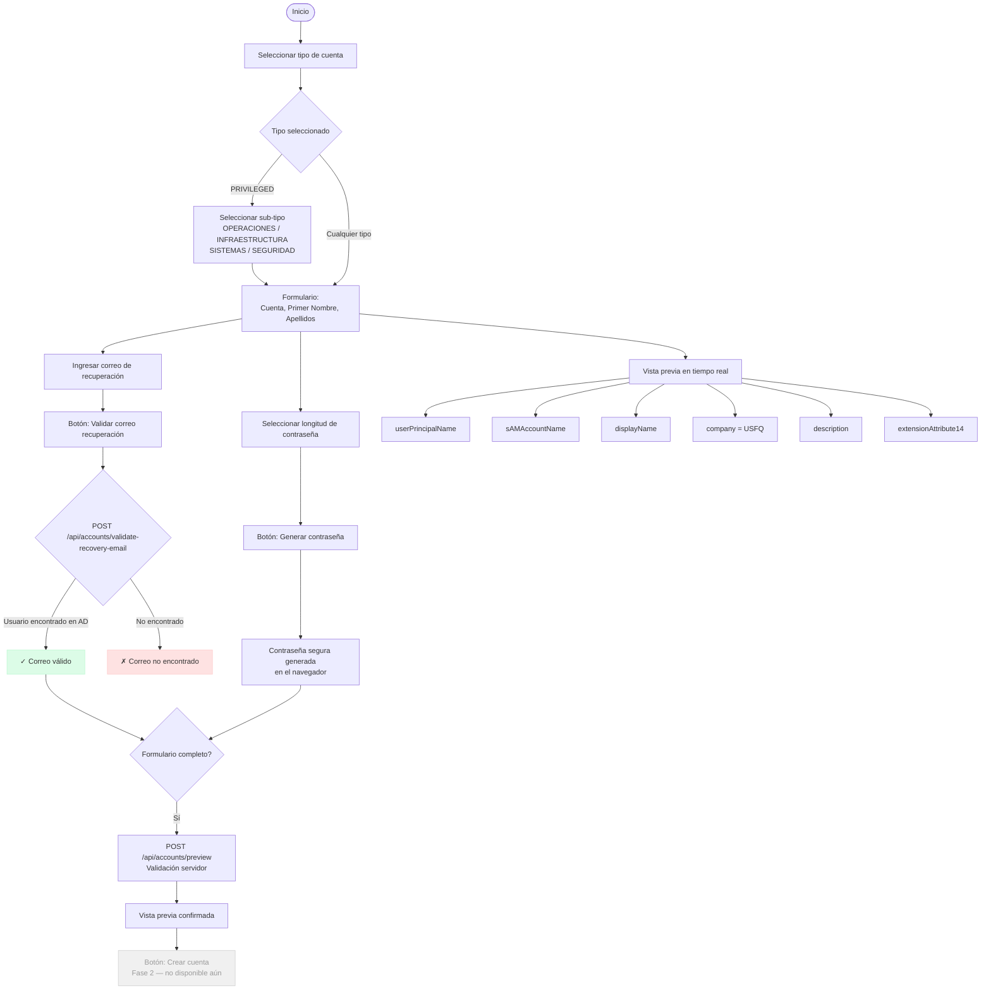

# Flujo de Creación de Cuentas — AccountGovernance

## Descripción

Este documento describe el flujo de trabajo para la creación de cuentas en Active Directory a través del portal AccountGovernance. La fase actual (v1) cubre la configuración y previsualización de parámetros. La creación efectiva en AD se implementará en la fase 2.

## Tipos de cuenta soportados

| Tipo         | Clave        | Sub-tipos              | sAMAccountName           | description   | extensionAttribute14 |
|--------------|--------------|------------------------|--------------------------|---------------|----------------------|
| Genérica     | `GENERIC`    | —                      | `{cuenta}`               | `Genérica`    | `Genérica`           |
| Partner      | `PARTNER`    | —                      | `{cuenta}`               | `PARTNERS`    | `PARTNERS`           |
| Servicio     | `SERVICE`    | —                      | `{cuenta}`               | `SERVICES`    | `SERVICES`           |
| Extensión    | `EXTENSION`  | —                      | `{cuenta}`               | `EXTENSION`   | `EXTENSION`          |
| Privilegiada | `PRIVILEGED` | OPERACIONES (`op`)     | `op{cuenta}`             | `PRIVILEGED`  | `PRIVILEGED`         |
|              |              | INFRAESTRUCTURA (`sa`) | `sa{cuenta}`             | `PRIVILEGED`  | `PRIVILEGED`         |
|              |              | SISTEMAS (`sys`)       | `sys{cuenta}`            | `PRIVILEGED`  | `PRIVILEGED`         |
|              |              | SEGURIDAD (`cyber`)    | `cyber{cuenta}`          | `PRIVILEGED`  | `PRIVILEGED`         |

## Reglas globales de generación de atributos

### Campo "Cuenta" (siempre ingresado por el técnico)

Para todos los tipos de cuenta el técnico ingresa manualmente el valor del campo **Cuenta** (p. ej. `jperez`). Este campo es la única fuente del sAMAccountName y el UPN. El valor se normaliza a minúsculas ASCII sin tildes ni caracteres especiales.

### sAMAccountName

- **GENERIC / PARTNER / SERVICE / EXTENSION**: `{cuenta}` (valor normalizado)
- **PRIVILEGED**: `{prefijo}{cuenta}` — el prefijo proviene del sub-tipo, concatenado directamente sin punto
  - Ejemplo: prefijo `sa` + cuenta `prueba` → `saprueba`

### userPrincipalName

`{sAMAccountName}@usfq.edu.ec`

### displayName

`{Primer Nombre} {Apellidos}` — campo único de apellidos (sin división primer/segundo apellido)

### company

`USFQ` para todos los tipos — valor configurable en `gov.AccountTypeConfigurations.DefaultCompany`

### description y extensionAttribute14

Ambos valores son estáticos y provienen de `gov.AccountTypeConfigurations`. El sub-tipo de PRIVILEGED solo influye en el sAMAccountName, no en description ni EA14.

| Tipo         | description  | extensionAttribute14 |
|--------------|--------------|----------------------|
| GENERIC      | `Genérica`   | `Genérica`           |
| PARTNER      | `PARTNERS`   | `PARTNERS`           |
| SERVICE      | `SERVICES`   | `SERVICES`           |
| EXTENSION    | `EXTENSION`  | `EXTENSION`          |
| PRIVILEGED   | `PRIVILEGED` | `PRIVILEGED`         |

---

## Campos del formulario

El formulario es **uniforme para todos los tipos** de cuenta:

| Campo                   | Notas                                        |
|-------------------------|----------------------------------------------|
| Cuenta *                | Ingresado por el técnico; fuente de UPN y SAM|
| Primer nombre *         |                                              |
| Apellidos *             | Campo único (sin división)                   |
| Correo de recuperación *| Validado contra AD                           |
| Contraseña              | Generada en el navegador con CSPRNG          |

No hay campos de Departamento, Empresa, ni Descripción — todos provienen de la configuración del tipo.

---

## Diagrama de flujo



---

## Endpoints API

### `GET /api/account-types`

Devuelve los tipos de cuenta con metadatos, template de descripción y sub-tipos.

**Respuesta:**
```json
[
  {
    "key": "GENERIC",
    "label": "Genérica",
    "extensionAttribute14": "Genérica",
    "isPrivileged": false,
    "defaultPasswordLength": 16,
    "defaultCompany": "USFQ",
    "descriptionTemplate": "Genérica",
    "subTypes": []
  },
  {
    "key": "PRIVILEGED",
    "label": "Privilegiada",
    "extensionAttribute14": "PRIVILEGED",
    "isPrivileged": true,
    "defaultPasswordLength": 20,
    "defaultCompany": "USFQ",
    "descriptionTemplate": "Cuenta privilegiada {SubType}",
    "subTypes": [
      { "subTypeKey": "OPERACIONES", "label": "Operaciones", "samPrefix": "op", "extensionAttribute14": "PRIV_OP" }
    ]
  }
]
```

### `POST /api/accounts/validate-recovery-email`

Valida que el correo de recuperación corresponda a un usuario existente en AD.

**Request:**
```json
{ "email": "jperez@usfq.edu.ec" }
```

**Response:**
```json
{ "isValid": true, "message": "Usuario encontrado en AD: Juan Perez", "userDisplayName": "Juan Perez" }
```

### `POST /api/accounts/preview`

Calcula los atributos AD que se asignarían a la nueva cuenta **sin crearla**.

**Request:**
```json
{
  "accountTypeKey": "PRIVILEGED",
  "subTypeKey":     "OPERACIONES",
  "accountName":    "jperez",
  "firstName":      "Juan",
  "apellidos":      "Pérez García"
}
```

**Response:**
```json
{
  "userPrincipalName":    "opjperez@usfq.edu.ec",
  "samAccountName":       "opjperez",
  "displayName":          "Juan Pérez García",
  "company":              "USFQ",
  "description":          "PRIVILEGED",
  "extensionAttribute14": "PRIVILEGED"
}
```

---

## Notas de implementación

- **Fase 1 (actual):** Visual y configuración — no crea cuentas en AD.
- **Fase 2 (pendiente):** Llamada real al AD Gateway para creación, asignación de grupos base, notificaciones.
- El campo **Cuenta** es siempre ingresado por el técnico para todos los tipos. Nunca se deriva del nombre o apellido.
- La contraseña se genera en el navegador con `crypto.getRandomValues` (CSPRNG).
- La validación del correo de recuperación usa un mock que acepta cualquier dirección `@usfq.edu.ec`.
- `Company = USFQ` se aplica a todos los tipos; configurable por tipo en `gov.AccountTypeConfigurations.DefaultCompany`.
- La única variable de plantilla activa en `DescriptionTemplate` es `{SubType}`.
