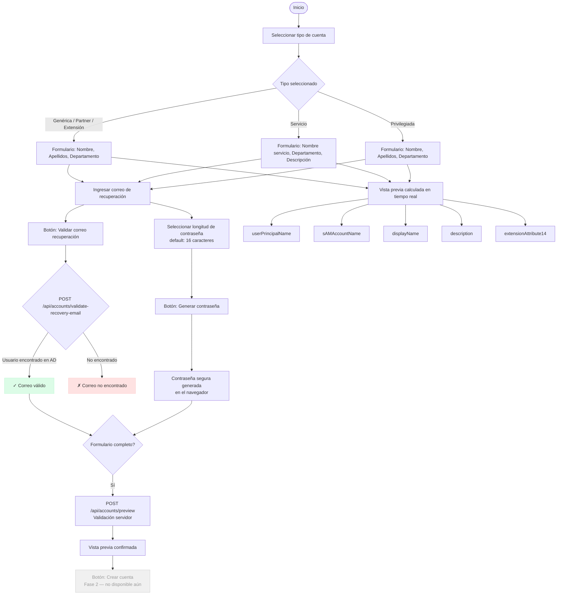

# Flujo de Creación de Cuentas — AccountGovernance

## Descripción

Este documento describe el flujo de trabajo para la creación de cuentas en Active Directory a través del portal AccountGovernance. La fase actual (v1) cubre la configuración y previsualización de parámetros. La creación efectiva en AD se implementará en la fase 2.

## Tipos de cuenta soportados

| Tipo                    | Clave              | Prefijo SAM | extensionAttribute14 | Privilegiada |
|-------------------------|--------------------|-------------|----------------------|:------------:|
| Genérica                | `generica`         | —           | `GENERICA`           | No           |
| Partner                 | `partner`          | —           | `PARTNER`            | No           |
| Servicio                | `service`          | `svc_`      | `SERVICIO`           | No           |
| Extensión               | `extension`        | —           | `EXTENSION`          | No           |
| Privilegiada Operaciones| `privileged-op`    | `op.`       | `PRIV_OP`            | Sí           |
| Privilegiada Infraestructura | `privileged-sa` | `sa.`      | `PRIV_SA`            | Sí           |
| Privilegiada Sist. Producción | `privileged-sys` | `sys.`  | `PRIV_SYS`           | Sí           |
| Privilegiada Seguridad  | `privileged-cyber` | `cyber.`    | `PRIV_CYB`           | Sí           |

## Reglas de generación de atributos

### sAMAccountName

- **Cuentas personales** (genérica, partner, extensión, privilegiadas):  
  `[prefijo.]` + primera letra del nombre + apellido1 — en minúsculas, sin tildes, sin caracteres especiales.  
  Ejemplo: `Juan Pérez` → `jperez` / `op.jperez`

- **Cuentas de servicio**:  
  `svc_` + nombre del servicio normalizado.  
  Ejemplo: `LDAP Sync` → `svc_ldapsync`

### userPrincipalName

`{sAMAccountName}@usfq.edu.ec`

### displayName

- Cuentas personales: `Primer Nombre + Apellido1 [+ Apellido2]` (no se incluye job title ni foto)
- Cuentas de servicio: `SVC - {NombreServicio}`

### description

Generada automáticamente según el tipo:

- Genérica: `Cuenta genérica — {Departamento}`
- Partner: `Cuenta partner — {Empresa}`
- Servicio: descripción ingresada por el usuario o `Cuenta de servicio — {NombreServicio}`
- Extensión: `Cuenta de extensión — {Departamento}`
- Privilegiadas: `Cuenta privilegiada {Tipo} — {Departamento}`

### extensionAttribute14

Código de tipo de cuenta (ver tabla arriba). Usado para clasificación y filtrado en AD.

---

## Diagrama de flujo



---

## Endpoints API

### `GET /api/account-types`

Devuelve la lista de tipos de cuenta soportados con sus metadatos (prefijo, extensionAttribute14, etc.).

**Respuesta:**
```json
[
  {
    "key": "generica",
    "label": "Genérica",
    "description": "Cuentas de usuarios internos estándar.",
    "prefix": null,
    "extensionAttribute14": "GENERICA",
    "isPrivileged": false
  }
]
```

### `POST /api/accounts/validate-recovery-email`

Valida que el correo de recuperación corresponda a un usuario existente en AD.

**Request:**
```json
{ "email": "jperez@usfq.edu.ec" }
```

**Response:**
```json
{
  "isValid": true,
  "message": "Usuario encontrado en AD: Juan Perez",
  "userDisplayName": "Juan Perez"
}
```

### `POST /api/accounts/preview`

Calcula los atributos AD que se asignarían a la nueva cuenta **sin crearla**.

**Request:**
```json
{
  "accountTypeKey": "privileged-op",
  "firstName":  "Juan",
  "lastName1":  "Pérez",
  "lastName2":  "García",
  "department": "Operaciones TI"
}
```

**Response:**
```json
{
  "userPrincipalName":    "op.jperez@usfq.edu.ec",
  "samAccountName":       "op.jperez",
  "displayName":          "Juan Pérez García",
  "description":          "Cuenta privilegiada Operaciones — Operaciones TI",
  "extensionAttribute14": "PRIV_OP"
}
```

---

## Notas de implementación

- **Fase 1 (actual):** Visual y configuración — no crea cuentas en AD.
- **Fase 2 (pendiente):** Llamada real al AD Gateway para creación, asignación de grupos base, notificaciones.
- El botón "Crear cuenta" está deshabilitado hasta que se implemente la fase 2.
- La contraseña se genera en el navegador con `crypto.getRandomValues` (CSPRNG).
- La validación del correo de recuperación usa un mock que acepta cualquier dirección `@usfq.edu.ec`.
