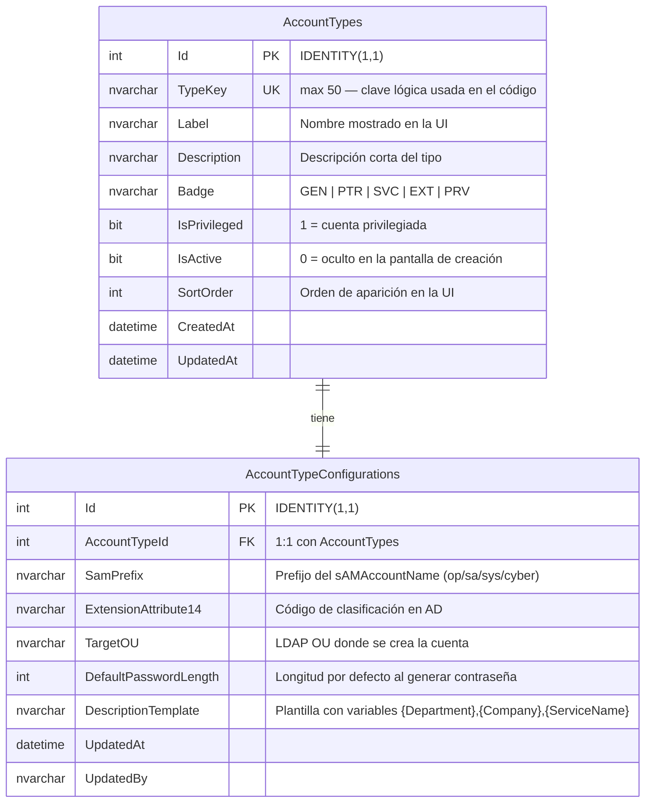
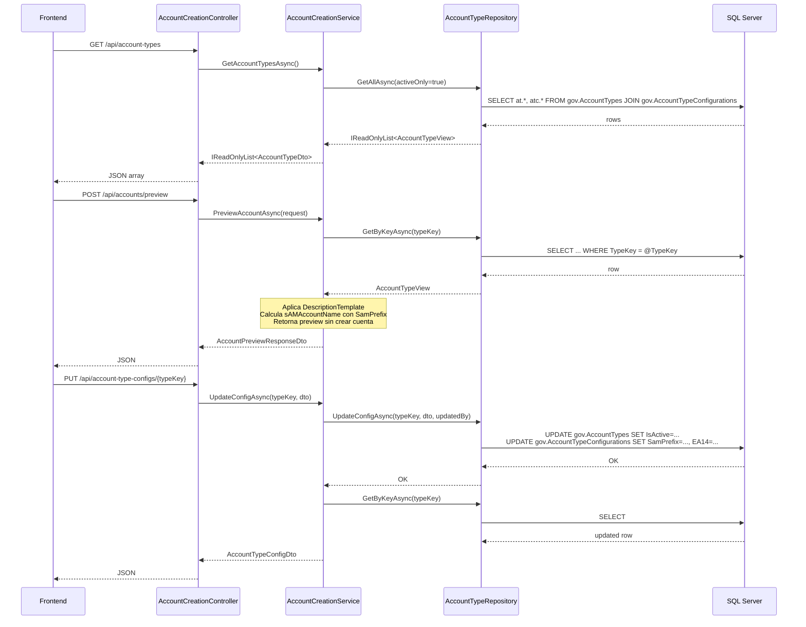

# Modelo de Datos — Tipos de Cuenta

## Propósito

Almacenar en base de datos los parámetros operacionales de cada tipo de cuenta AD, eliminando valores quemados del código fuente. Los tipos de cuenta y su configuración son ahora administrables desde la pantalla **Configuración → Tipos de Cuenta**.

---

## Diagrama entidad-relación

---

## Descripción de tablas

### `gov.AccountTypes`

| Columna       | Tipo          | Descripción |
|---------------|---------------|-------------|
| `Id`          | INT           | PK auto-incremental |
| `TypeKey`     | NVARCHAR(50)  | Clave lógica única usada en código (`generica`, `privileged-op`, …) |
| `Label`       | NVARCHAR(100) | Nombre mostrado en la UI |
| `Description` | NVARCHAR(500) | Texto descriptivo |
| `Badge`       | NVARCHAR(10)  | Abreviación para la tarjeta visual (GEN, PTR, SVC, EXT, PRV) |
| `IsPrivileged`| BIT           | 1 = cuenta privilegiada; muestra badge rojo |
| `IsActive`    | BIT           | 0 = excluido de la pantalla de creación |
| `SortOrder`   | INT           | Posición en la UI |

### `gov.AccountTypeConfigurations`

| Columna                | Tipo          | Descripción |
|------------------------|---------------|-------------|
| `Id`                   | INT           | PK auto-incremental |
| `AccountTypeId`        | INT           | FK → `gov.AccountTypes.Id` (UNIQUE: 1:1) |
| `SamPrefix`            | NVARCHAR(20)  | Prefijo para `sAMAccountName` (`op`, `sa`, `sys`, `cyber`; NULL = sin prefijo) |
| `ExtensionAttribute14` | NVARCHAR(50)  | Código de tipo almacenado en AD (`GENERICA`, `PRIV_OP`, …) |
| `TargetOU`             | NVARCHAR(500) | Ruta LDAP donde se crea la cuenta (`OU=Genericas,DC=usfq,DC=edu,DC=ec`) |
| `DefaultPasswordLength`| INT           | Longitud de contraseña por defecto al crear este tipo (8–64) |
| `DescriptionTemplate`  | NVARCHAR(500) | Plantilla con variables: `{Department}`, `{Company}`, `{ServiceName}` |
| `UpdatedAt`            | DATETIME2     | Última modificación de la configuración |
| `UpdatedBy`            | NVARCHAR(200) | Usuario (del JWT) que realizó la última modificación |

---

## Variables de plantilla en `DescriptionTemplate`

| Variable          | Se sustituye con                              |
|-------------------|-----------------------------------------------|
| `{Department}`    | Campo Departamento del formulario             |
| `{Company}`       | Campo Empresa (tipos partner)                 |
| `{ServiceName}`   | Campo Nombre del servicio (tipo service)      |

Ejemplos de plantillas en la semilla:

| TypeKey            | DescriptionTemplate |
|--------------------|---------------------|
| `generica`         | `Cuenta genérica — {Department}` |
| `partner`          | `Cuenta partner — {Company}` |
| `service`          | `Cuenta de servicio — {ServiceName}` |
| `privileged-op`    | `Cuenta privilegiada Operaciones — {Department}` |

---

## Flujo de datos

---

## API Endpoints

| Método | URL | Descripción |
|--------|-----|-------------|
| `GET`  | `/api/account-types` | Lista tipos activos con config básica (pantalla de creación) |
| `GET`  | `/api/account-type-configs` | Lista todos los tipos + config completa (pantalla admin) |
| `GET`  | `/api/account-type-configs/{typeKey}` | Config completa de un tipo |
| `PUT`  | `/api/account-type-configs/{typeKey}` | Actualiza la configuración de un tipo |
| `POST` | `/api/accounts/validate-recovery-email` | Valida correo contra AD |
| `POST` | `/api/accounts/preview` | Previsualiza atributos AD sin crear cuenta |

---

## Decisiones de diseño

- **Relación 1:1** entre `AccountTypes` y `AccountTypeConfigurations` permite separar lo que "es" un tipo (label, badge, isPrivileged) de cómo se "configura" operacionalmente (OU, prefijo, etc.) sin complejidad adicional.
- **`IsActive` en `gov.AccountTypes`** controla visibilidad global. Los registros nunca se borran.
- **`DescriptionTemplate`** elimina el switch-statement del servicio. La lógica de descripción es ahora configurable sin recompilar.
- **`SamPrefix = NULL`** significa sin prefijo (cuentas genéricas). El código agrega `svc_` para tipo `service` (no es un prefijo de tabla porque el formato es diferente: `svc_` + nombre, no `svc.` + inicialApellido).
