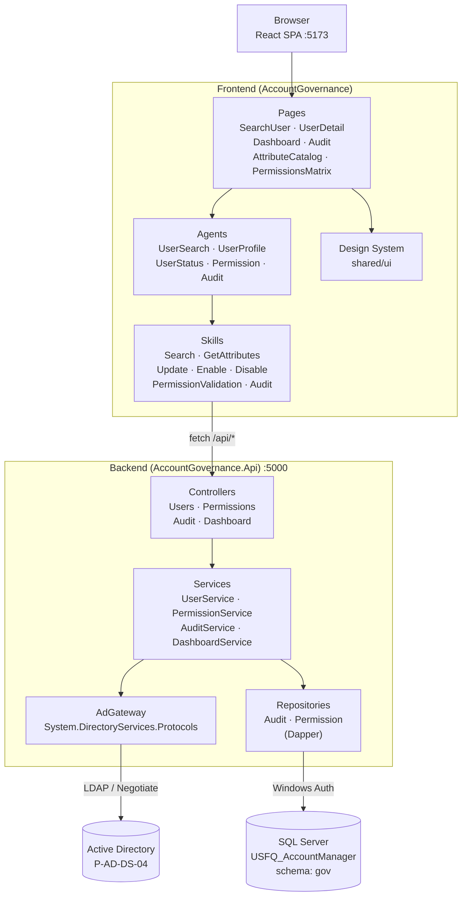

# Diagrama — Arquitectura del Sistema

```mermaid
graph TB
    Browser["Browser\nReact SPA :5173"]

    subgraph Frontend ["Frontend (AccountGovernance)"]
        Pages["Pages\nSearchUser · UserDetail\nDashboard · Audit\nAttributeCatalog · PermissionsMatrix"]
        Agents["Agents\nUserSearch · UserProfile\nUserStatus · Permission · Audit"]
        Skills["Skills\nSearch · GetAttributes\nUpdate · Enable · Disable\nPermissionValidation · Audit"]
        DS["Design System\nshared/ui"]
    end

    subgraph API ["Backend (AccountGovernance.Api) :5000"]
        Controllers["Controllers\nUsers · Permissions\nAudit · Dashboard"]
        Services["Services\nUserService · PermissionService\nAuditService · DashboardService"]
        Gateway["AdGateway\nSystem.DirectoryServices.Protocols"]
        Repos["Repositories\nAudit · Permission\n(Dapper)"]
    end

    AD[("Active Directory\nP-AD-DS-04")]
    DB[("SQL Server\nUSFQ_AccountManager\nschema: gov")]

    Browser --> Pages
    Pages --> Agents
    Agents --> Skills
    Skills -->|"fetch /api/*"| Controllers
    Pages --> DS

    Controllers --> Services
    Services --> Gateway
    Services --> Repos
    Gateway -->|"LDAP / Negotiate"| AD
    Repos -->|"Windows Auth"| DB
```
