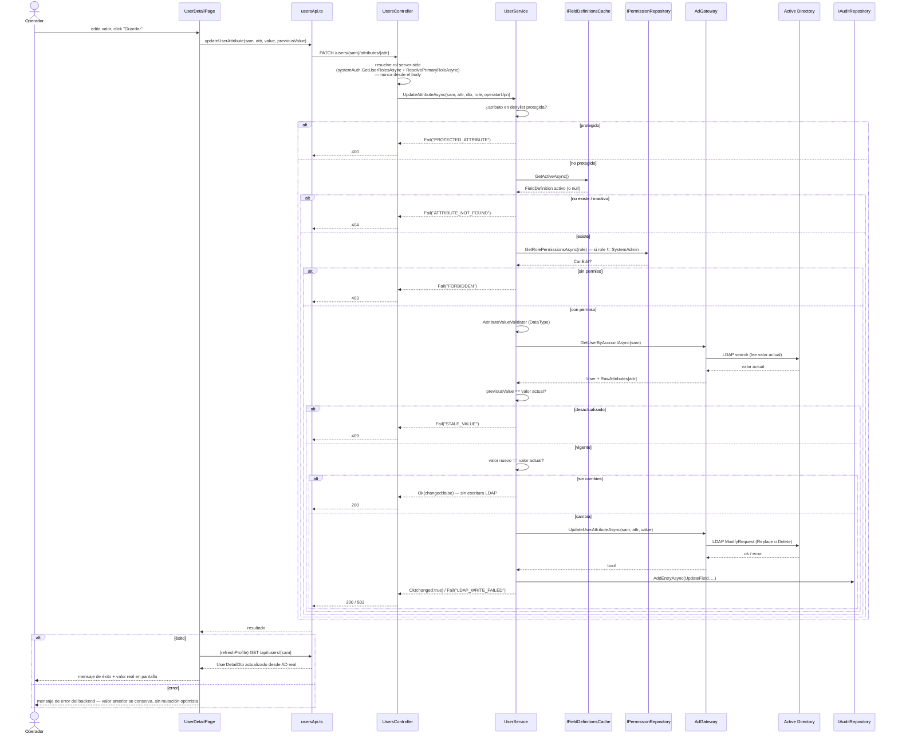

# Diagrama — Flujo de Escritura de Atributos de Usuario

Cubre `PATCH /api/users/{samAccountName}/attributes/{adAttributeName}`. El
flujo de `PATCH /api/users/{samAccountName}/status` (habilitar/deshabilitar
cuenta) es idéntico en las capas de permisos y auditoría — solo difiere en
`AdGateway`, donde en vez de un `Replace`/`Delete` genérico se hace un toggle
del bit `ACCOUNTDISABLE` de `userAccountControl` preservando el resto de flags
(`SetAccountEnabledAsync`, ver `docs/backend/endpoints.md`).

