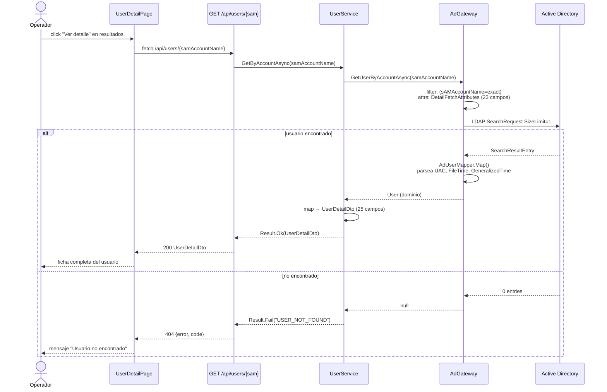

# Diagrama — Flujo de Detalle de Usuario

```mermaid
sequenceDiagram
    actor Operator as Operador
    participant Page as UserDetailPage
    participant API as GET /api/users/{sam}
    participant Svc as UserService
    participant GW as AdGateway
    participant AD as Active Directory

    Operator->>Page: click "Ver detalle" en resultados
    Page->>API: fetch /api/users/{samAccountName}
    API->>Svc: GetByAccountAsync(samAccountName)
    Svc->>GW: GetUserByAccountAsync(samAccountName)
    GW->>GW: filter: (sAMAccountName=exact)<br/>attrs: DetailFetchAttributes (23 campos)
    GW->>AD: LDAP SearchRequest SizeLimit=1
    alt usuario encontrado
        AD-->>GW: SearchResultEntry
        GW->>GW: AdUserMapper.Map()<br/>parsea UAC, FileTime, GeneralizedTime
        GW-->>Svc: User (dominio)
        Svc->>Svc: map → UserDetailDto (25 campos)
        Svc-->>API: Result.Ok(UserDetailDto)
        API-->>Page: 200 UserDetailDto
        Page-->>Operator: ficha completa del usuario
    else no encontrado
        AD-->>GW: 0 entries
        GW-->>Svc: null
        Svc-->>API: Result.Fail("USER_NOT_FOUND")
        API-->>Page: 404 {error, code}
        Page-->>Operator: mensaje "Usuario no encontrado"
    end
```
