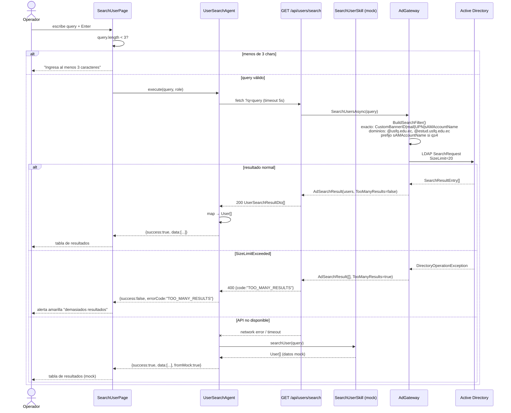

# Diagrama — Flujo de Búsqueda de Usuario

```mermaid
sequenceDiagram
    actor Operator as Operador
    participant Page as SearchUserPage
    participant Agent as UserSearchAgent
    participant API as GET /api/users/search
    participant Mock as SearchUserSkill (mock)
    participant GW as AdGateway
    participant AD as Active Directory

    Operator->>Page: escribe query + Enter
    Page->>Page: query.length < 3?
    alt menos de 3 chars
        Page-->>Operator: "Ingresa al menos 3 caracteres"
    else query válido
        Page->>Agent: execute(query, role)
        Agent->>API: fetch ?q=query (timeout 5s)
        API->>GW: SearchUsersAsync(query)
        GW->>GW: BuildSearchFilter()<br/>exacto: CustomBannerID|mail|UPN|sAMAccountName<br/>dominios: @usfq.edu.ec, @estud.usfq.edu.ec<br/>prefijo sAMAccountName si q≥4
        GW->>AD: LDAP SearchRequest<br/>SizeLimit=20
        alt resultado normal
            AD-->>GW: SearchResultEntry[]
            GW-->>API: AdSearchResult(users, TooManyResults=false)
            API-->>Agent: 200 UserSearchResultDto[]
            Agent->>Agent: map → User[]
            Agent-->>Page: {success:true, data:[...]}
            Page-->>Operator: tabla de resultados
        else SizeLimitExceeded
            AD-->>GW: DirectoryOperationException
            GW-->>API: AdSearchResult([], TooManyResults=true)
            API-->>Agent: 400 {code:"TOO_MANY_RESULTS"}
            Agent-->>Page: {success:false, errorCode:"TOO_MANY_RESULTS"}
            Page-->>Operator: alerta amarilla "demasiados resultados"
        else API no disponible
            API--xAgent: network error / timeout
            Agent->>Mock: searchUser(query)
            Mock-->>Agent: User[] (datos mock)
            Agent-->>Page: {success:true, data:[...], fromMock:true}
            Page-->>Operator: tabla de resultados (mock)
        end
    end
```
